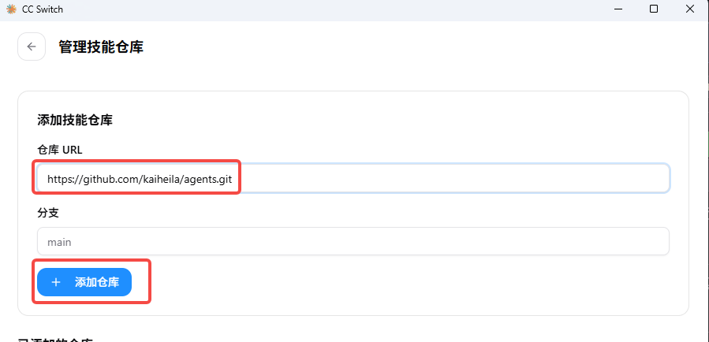
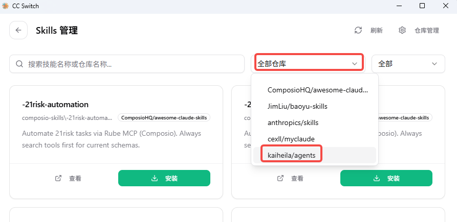
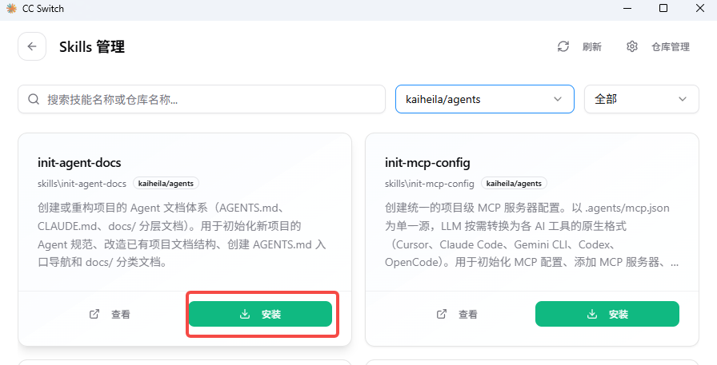
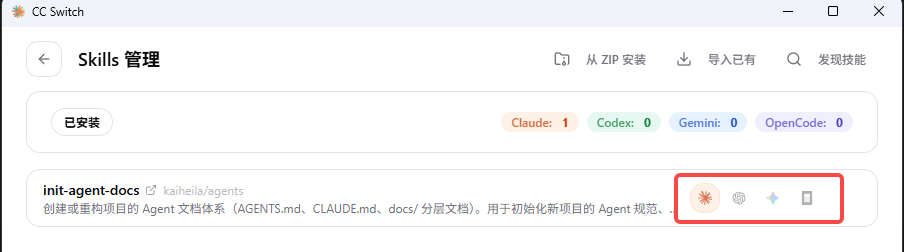

# Agents 仓库
存放所有共享的 Agent\MCP\Skill

##
Agent Skills，兼容 [CC Switch](https://github.com/farion1231/cc-switch)、Claude Code、Codex、Cursor 等工具。

### 全局Skill 管理：通过 CC Switch 安装

1. 打开 CC Switch → Skills → 仓库管理

2. 添加仓库：`kaiheila/agents`

3. 浏览并一键安装所需 Skills，在主流的 Agent 工具中使用

### 项目级 Skill 管理

项目中已安装 `skill-installer` 后，直接对 AI 说：

> "列出所有可用的 skills"

> "帮我安装 init-agent-docs"

### Skills 列表

| Skill | 说明 |
|-------|------|
| **skill-installer** | 从仓库安装 Skills 到当前项目 `.agents/skills/` 目录 |
| **skill-publisher** | 将项目中的 Skill 发布到仓库，自动创建分支和 Merge Request |
| **skill-creator** | Skills 创建最佳实践指南（设计原则、规范、示例、排错） |
| **init-agent-docs** | 创建项目 Agent 文档体系（AGENTS.md、CLAUDE.md、docs/） |
| **init-mcp-config** | 创建统一 MCP 配置，兼容 Cursor / Claude Code / Gemini CLI / Codex |
| **init-unified-skills** | 创建多 Agent 兼容 skill 目录结构，通过软链接兼容各工具 |
